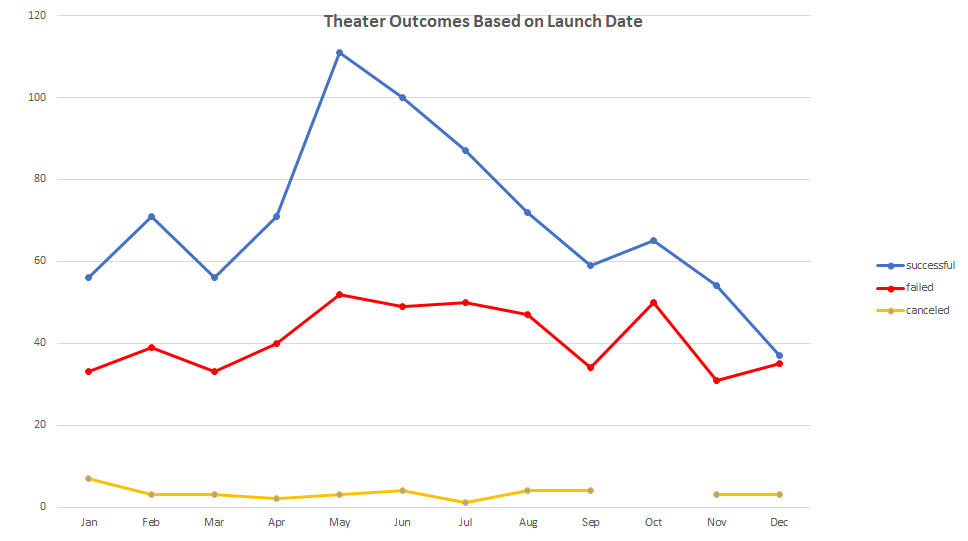
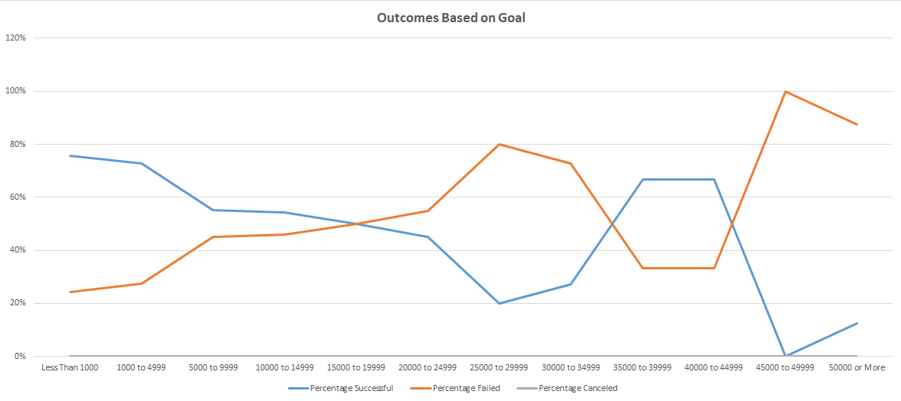

# Kickstarter-Analysis

## **Overview of Project**

### To study how different campaigns fared in relation to their launch dates and their funding goals using the Kickstarter dataset.

## **Analysis and Challenges**

### Analysis of Outcomes Based on Launch Date

  _1. Create a Pivot Table with the count of outcomes (for successful, failed, and canceled campaigns) vs. launch dates (on a monthly basis) for theater._ 
  
  _2. Use the Line with Markers in the pivot chart to plot the count of outcomes against the launch dates._
  
  

### Analysis of Outcomes Based on Goals

  _1. Create a table with headers: Goal, Number Successful, Number Failed, Number Canceled, Total Projects, Percentage Successful, Percentage Failed, and Percentage Canceled._ 
  
  _2. Create dollar-amount ranges in the "Goal" column so projects can be grouped based on their goal amount._ 
 
  _3. Use function "countifs()" to count numbers for successful, failed, and canceled events for each amount range, with "plays" selected for "Subcategory"._ 
  
  _4. Calculate the Total Projects by summing the events in each amount range._ 
  
  _5. Calculate the percentages for successful, failed, and canceled for each amount range._ 
  
  _6. Use the Line chart to plot the percentages against the amount ranges for successful, failed, and canceled._
  
  

### Challenges and Difficulties Encountered

- _In performing an analysis of Outcome Based on Launch Date, the possible challenge would be to discover a way to display only the months in Axis, which can be achieved by grouping the data._

- _In performing an analysis of Outcomes Based on Goals, the possible challenge would be to correctly define the criteria for each amount range. For example, to search Number Successful between 1000 and 4999, Criteria #1 would need to be set to ">=1000" and Criteria #2 would need to be set to "<5000" in order to find any events in Kickstarter!$D:$D, which has a successful outcome in plays._ 

## Results

- What are two conclusions you can draw about the Outcomes based on Launch Date?

  - _The month that launched the most successful Kickstarter campaigns was May._
  - _May, June, July, August, and October all had roughly the same number of failed campaigns launched._

- What can you conclude about the Outcomes based on Goals?

  - _The campaigns with higher numbers in Goal had higher percentages of failure._

- What are some limitations of this dataset?

  - _This dataset is skewed to the right in both successful and failed campaigns._
  - _Dataset only covered years between 2010 and 2017.
  - _Dataset only included data collected from specific countries, not worldwide. 

- What are some other possible tables and/or graphs that we could create?

  - _Outcomes Based on Subcategory in Music, with Parent Category and Country set as Filters._
  - _Sum of Pledged in All Outcomes in Music Based on Launch Year, with Parent Category and Country set as Filters._
